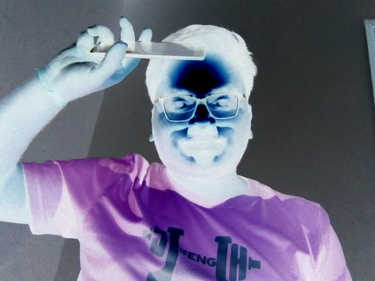

# You-Devil

React app to see yourself in the devil look 👻!  
(Can also take photo to share with friends).

## Demo

You can also try out the [live demo](https://coderkd10.github.io/you-devil/).

## How it works ?

We simply take video from the webcam and apply an inversion filter on it.  

### TODO

In the future I'll try out more advanced filters (implemented in WebAssembly possibly) to give a more SnapChat like feel. Probably will add some devil horns etc.

Some short term todos - 

- Run `eslint` with `--fix`.
- Handle case of no `getUserMedia`.
- Layout is broken on phone.
- Add error boundary.
- Turns out you can also apply multiple filters together. `hue-rotate` filter also looks great; and hue rotation of 90 / 180 deg along with inversion seemed to be look better. Experiment with those (and other filters) and add a better looking default to the site. Also add advanced setting button which reveals some slider / control dials where you can futher tweek those settings to your liking. It should perist across sessions (use localstorage) and also add button to reset default. Option to export the settings to a json file and ability to load settings from a file will also be awesome.
